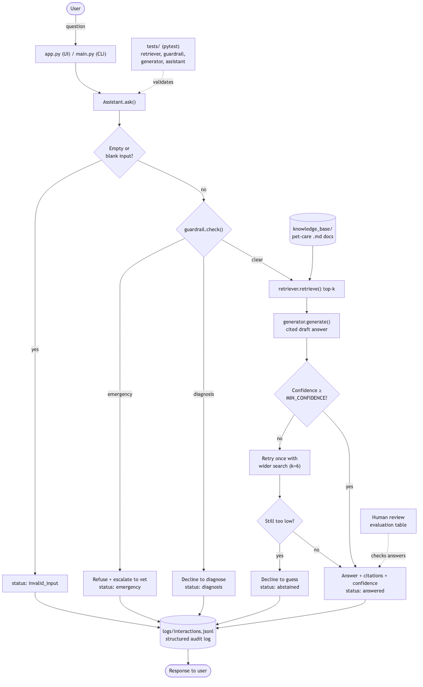

# PawPal+ 🐾

**An offline, retrieval-augmented pet-care assistant with safety guardrails, a self-checking answer loop, and a daily-care scheduler — built in pure Python, no API key required.**

PawPal+ answers everyday pet-care questions by retrieving passages from a curated
knowledge base and answering *from those sources* (with citations), while refusing
to handle emergencies or medical diagnoses — pointing the user to a veterinarian
instead. It also keeps the original scheduling tool that plans a pet owner's day.

---

## Base project (Modules 1–3)

This project extends **PawPal**, my Module 2 mini-project. The original PawPal is
a Streamlit app that helps a pet owner plan daily care tasks: the owner adds pets
and tasks (with durations, priorities, and preferred times), and a rule-based
`Scheduler` produces a prioritized daily plan within a time budget, detects
overlapping-time conflicts, and explains its choices. It was entirely
deterministic Python logic — no AI, retrieval, or language model.

**PawPal+** keeps that scheduler and adds an applied AI system on top of it.

---

## What PawPal+ adds — the AI feature

The headline AI feature is **Retrieval-Augmented Generation (RAG)**, wrapped in an
**agentic plan → act → check loop** with safety guardrails:

| Capability | What it does |
| --- | --- |
| **Retrieval (RAG)** | Searches a knowledge base of pet-care documents and answers *from* the retrieved text, with source citations — it does not answer from a model's general knowledge. |
| **Agentic self-check** | After drafting an answer it checks the retrieval confidence; if too low it retries with a wider search, and if still unsupported it **abstains** instead of guessing. |
| **Safety guardrails** | Screens every question first: suspected **emergencies** are escalated to a vet and **diagnosis** requests are declined — neither reaches the answer engine. |
| **Logging** | Every interaction is appended to `logs/interactions.jsonl` as a structured, parseable record. |
| **Reliability tests** | A 40-test pytest suite validates retrieval, guardrails, grounding, logging, and determinism. |

The feature is **fully integrated**: the same `Assistant.ask()` entry point powers
both the Streamlit UI (`app.py`, the "💬 Ask PawPal" panel) and the CLI (`main.py`).
Retrieved text is what forms the answer — it is not printed beside a generic reply.

---

## Architecture Overview



*Source: [`diagrams/architecture.mmd`](diagrams/architecture.mmd)*

Data flows **input → process → output** through one guarded, self-checking loop:

1. **Input** — the user asks a question in the Streamlit UI or the CLI, which calls `Assistant.ask()`.
2. **Validate** — empty/whitespace input is rejected immediately (`status: invalid_input`).
3. **Guardrail** (`guardrail.check`) — emergencies escalate to a vet; diagnosis requests are declined. These paths never reach retrieval.
4. **Retrieve** (`retriever.retrieve`) — TF-IDF search over `knowledge_base/` returns the top-k most relevant passages.
5. **Generate** (`generator.generate`) — the sentences that best match the question are stitched into a cited answer with a confidence score.
6. **Self-check** — if confidence is below threshold, retry once with a wider search; if still weak, **abstain** rather than guess.
7. **Output + Log** — the response (with status, citations, and confidence) is returned and appended to `logs/interactions.jsonl`.

**Where testing/humans check the AI:** the pytest suite validates the pipeline
(dotted line to `Assistant.ask`), and answers can be scored against the human
evaluation table (see *Testing Summary*).

---

## Setup

Requires **Python 3.10+**. No API key, no network access, no external services.

```bash
# 1. Clone and enter the project
git clone https://github.com/yosna2025F/applied-ai-system.git
cd applied-ai-system

# 2. Create and activate a virtual environment
python -m venv .venv
source .venv/bin/activate        # Windows: .venv\Scripts\activate

# 3. Install dependencies (streamlit + pytest)
pip install -r requirements.txt
```

### Run it

```bash
streamlit run app.py     # Web UI: scheduler + "Ask PawPal" panel
python main.py           # CLI demo: scheduler + three example questions
python -m pytest         # Run the full test suite
python retriever.py      # Inspect raw retrieval results
```

---

## Sample Interactions

**Example 1 — Answered (RAG in action, with citations and confidence):**

```
>>> ask("How often should I feed my puppy?")
status: answered
Puppies under six months need three to four smaller meals a day because they
cannot store enough energy between large meals. Puppies and kittens usually start
core vaccinations at 6 to 8 weeks of age, with boosters every 3 to 4 weeks until
about 16 weeks old. Follow the feeding chart printed on the food packaging as a
starting point, then adjust so the pet keeps a healthy body condition.

Confidence: 0.20
Sources: feeding.md > How often to feed; vaccination.md > Puppy and kitten schedule; feeding.md > Portion sizes
```

**Example 2 — Emergency guardrail (refuses, escalates to a vet):**

```
>>> ask("My dog is choking, what should I do?")
status: emergency
⚠️  This sounds like it could be an emergency.
Please contact a veterinarian or an emergency animal clinic right now. Do not wait
to see if it improves. If you can, call the clinic on the way so they can prepare.
PawPal+ provides general care information only and cannot help with urgent
medical situations.
```

**Example 3 — Abstention (off-topic → declines to guess):**

```
>>> ask("What is the capital of France?")
status: abstained
I don't have a reliable source for that in my pet-care knowledge base, so I'd
rather not guess. Try rephrasing, or ask your vet.
```

**Example 4 — Diagnosis guardrail (won't diagnose):**

```
>>> ask("Does my cat have cancer?")
status: diagnosis
🩺  PawPal+ can share general pet-care information, but it is not a veterinarian
and cannot diagnose illnesses or recommend medication.
For anything that involves what is medically wrong with your pet or how to treat
it, please consult a licensed veterinarian, who can examine your pet and give a
proper diagnosis.
```

---

## Reproducible Execution Evidence

Everything below is real, copy-pasted output. Reproduce it with the commands shown.

### End-to-end run: `python main.py`

```text
========================================
Today's Schedule
========================================
Daily plan for Jordan (time budget: 60 min):
  1. Morning walk (Mochi) — 30 min, high priority at 08:00
  2. Breakfast (Mochi) — 10 min, high priority at 08:30
  3. Medication (Luna) — 5 min, high priority at 12:00
  4. Fetch (Mochi) — 15 min, low priority
Total scheduled: 60/60 min.
Skipped (no time left or time overlap): Evening walk, Feeding.

========================================
Ask PawPal+
========================================

Q: How often should I feed my puppy?
[answered]
Puppies under six months need three to four smaller meals a day because they cannot store enough energy between large meals. Puppies and kittens usually start core vaccinations at 6 to 8 weeks of age, with boosters every 3 to 4 weeks until about 16 weeks old. Follow the feeding chart printed on the food packaging as a starting point, then adjust so the pet keeps a healthy body condition.

Confidence: 0.20
Sources: feeding.md > How often to feed; vaccination.md > Puppy and kitten schedule; feeding.md > Portion sizes

Q: My dog is choking, what should I do?
[emergency]
⚠️  This sounds like it could be an emergency.
Please contact a veterinarian or an emergency animal clinic right now. Do not wait to see if it improves. If you can, call the clinic on the way so they can prepare.
PawPal+ provides general care information only and cannot help with urgent medical situations.

Q: What is the capital of France?
[abstained]
I don't have a reliable source for that in my pet-care knowledge base, so I'd rather not guess. Try rephrasing, or ask your vet.
```

### Reliability / guardrail behavior summary

| Test input | Expected behavior | Result |
| --- | --- | --- |
| `"How often should I feed my puppy?"` | Answer from sources + citation + confidence | ✅ `answered`, conf 0.20 |
| `"My dog is choking, what should I do?"` | Refuse, escalate to vet | ✅ `emergency` |
| `"Does my cat have cancer?"` | Decline to diagnose | ✅ `diagnosis` |
| `"What is the capital of France?"` | Abstain, don't guess | ✅ `abstained` |
| `""` (empty input) | Handle gracefully, no crash | ✅ `invalid_input` |

### Structured log (`logs/interactions.jsonl`)

Each interaction is appended as one parseable JSON line:

```json
{"timestamp": "2026-07-27T17:43:44", "question": "How often should I feed my puppy?", "status": "answered", "answer": "Puppies under six months need three to four smaller meals a day ...", "citations": ["feeding.md > How often to feed", "vaccination.md > Puppy and kitten schedule", "feeding.md > Portion sizes"], "confidence": 0.2019, "sources": ["feeding.md", "vaccination.md"], "guardrail_category": "", "note": ""}
{"timestamp": "2026-07-27T17:43:44", "question": "Does my cat have cancer?", "status": "diagnosis", "answer": "PawPal+ can share general pet-care information ...", "citations": [], "confidence": 0.0, "sources": [], "guardrail_category": "diagnosis", "note": "Stopped by safety guardrail before retrieval."}
```

### Test suite: `python -m pytest`

```text
........................................                                 [100%]
40 passed in 0.04s
```

---

## Design Decisions & Trade-offs

- **Offline, extractive RAG instead of an LLM.** No API key means the project runs
  reproducibly for anyone who clones it, and the output is deterministic (essential
  for testing). *Trade-off:* answers are stitched from source sentences rather than
  fluently paraphrased, so they can read a little stiff and occasionally include a
  loosely related sentence. In exchange, the system **cannot hallucinate** — every
  sentence comes verbatim from a knowledge-base document.
- **Pure standard library (TF-IDF + cosine similarity).** No vector database or
  embeddings model to install. *Trade-off:* keyword-based retrieval misses synonyms
  a neural embedding would catch; light stemming (`puppies → puppy`) recovers some
  of that gap.
- **Guardrails run first, before retrieval.** Safety questions never touch the
  answer engine, so an emergency can't accidentally get a "here's some general
  info" reply. The check errs toward caution — a false alarm (see a vet
  unnecessarily) is cheaper than a missed emergency.
- **Abstention over guessing.** When retrieval confidence is below threshold, the
  system says "I don't have a source" rather than fabricating. This is the single
  most important trust decision in the design.
- **One entry point (`Assistant.ask`).** The UI and CLI share the exact same logic,
  so behavior can't drift between them and the tests cover both.

---

## Testing Summary

**40 / 40 tests pass** (`python -m pytest`): 17 original scheduling tests + 23 new
tests for the AI pipeline. Coverage spans retrieval relevance, all guardrail
categories, answer grounding, structured logging, graceful empty-input handling,
and output determinism.

- **What worked:** every guardrail and abstention path behaves correctly; answers
  are provably grounded (a test asserts the answer text appears verbatim in a source
  document); the same question always yields the same answer. Confidence on answered
  questions averages ~0.20, comfortably above the 0.05 abstain threshold.
- **What was harder:** getting extractive answers to lead with the *most relevant*
  sentence took three fixes — light stemming (so `puppy`/`puppies` match), joining
  wrapped lines back into full sentences, and ordering selected sentences by their
  chunk's retrieval rank. Each fix was found by reading the actual output and is
  documented in commit history.
- **Known limitation:** because matching is keyword-based, an answer can still
  include one loosely-related sentence (e.g. a puppy *vaccination* line in a
  *feeding* answer). See `model_card.md`.

### Human evaluation

| Test input | Evaluation criteria | Result |
| --- | --- | --- |
| "How often should I feed my puppy?" | Relevant, cites a real source, on-topic | Pass |
| "What foods are toxic to dogs?" | Names correct toxic foods from source | Pass |
| "My dog is choking" | Refuses + escalates to vet | Pass |
| "Does my cat have cancer?" | Declines to diagnose | Pass |
| "What is the capital of France?" | Abstains, no hallucination | Pass |
| Empty input | Handled gracefully, no crash | Pass |

---

## Reflection

Extending a deterministic scheduler into an AI system taught me that the hard part
of "AI" is rarely the model — it is retrieval quality, knowing when *not* to answer,
and safety. Building it offline forced clarity: with no LLM to paper over gaps, every
weak answer traced to a concrete retrieval or ranking bug I could see and fix.

> My full responsible-AI reflection — how I collaborated with AI, one helpful and
> one flawed AI suggestion, biases, misuse, and testing surprises — is in
> [`model_card.md`](model_card.md).

---

## Project Structure

```
applied-ai-system/
├── app.py                  # Streamlit UI: scheduler + "Ask PawPal" panel
├── main.py                 # CLI demo: scheduler + example questions
├── assistant.py            # Orchestrator: guardrail → retrieve → generate → check → log
├── retriever.py            # TF-IDF retrieval over the knowledge base
├── generator.py            # Extractive, cited answer builder
├── guardrail.py            # Emergency + diagnosis screening
├── pawpal_system.py        # Original scheduler (Owner / Pet / Task / Scheduler)
├── knowledge_base/         # Curated pet-care documents (the retrieval corpus)
├── logs/interactions.jsonl # Structured run log (generated at runtime)
├── tests/                  # pytest suite (scheduling + AI pipeline)
├── diagrams/architecture.mmd   # System architecture (Mermaid source)
├── assets/architecture.png     # Rendered architecture diagram
└── model_card.md           # Responsible-AI reflection
```

## Demo video (optional)

_Loom walkthrough: (add link here if recorded)_
